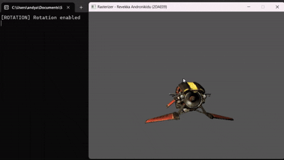

# CPU Software Rasterizer (SDL)
A CPU-based software rasterizer written in C++ using SDL2, built to explore how a modern 3D graphics pipeline works under the hood — without using OpenGL, DirectX, or Vulkan.
The rasterizer  was built as part of the Graphics Programming 1 course and supports perspective projection, depth buffering, texture mapping, normal mapping, and basic BRDF-based shading, all implemented on the CPU.

## Features
- Triangle rasterization in software
- Perspective projection using a projection matrix
- Texture mapping (UV coordinates)
- Depth buffering (Z-buffer)
- Basic vertex transformations (model → view → projection)
- Simple fragment shading

## Implemented Rendering Pipeline
### 1. Vertex Processing
 - Model → View → Projection transformation
- World/View/Projection matrices
- Perspective divide (clip space → NDC)
- Frustum checks

### 2. Rasterization
- Bounding-box optimized triangle rasterization
- Barycentric coordinate calculation
- Perspective-correct interpolation for:
  - Depth
  - UVs
  - Normals
  - Tangents
  - View direction
    
### 3. Depth Testing
- Per-pixel Z-buffer
- Early depth rejection
- Optional depth visualization mode

### 4. Pixel Shading
- Lambert diffuse BRDF
- Phong specular BRDF
- Normal mapping using tangent space
- Combined lighting mode

## Shading Modes
Toggle between shading modes at runtime:
- Observed area
- Diffuse
- Specular
- Ambient
- Combined
  
## Render Modes
- Texture Mode – Full shaded output
- Depth Buffer Mode – Visualizes depth values

## Controls
| Key | Action |
|-----|-------|
| F4  | Cycle Render Mode |
| F5  | Toggle Rotation |
| F6  | Toggle Normal Map |
| F7  | Cycle Shading Mode |

## Learning Goals
This project was built as a learning-focused renderer, with emphasis on:
- Understanding projection matrices
- Perspective-correct interpolation
- Depth buffering
- Triangle rasterization
- CPU-side rendering performance tradeoffs
- Lighting and BRDF fundamentals

